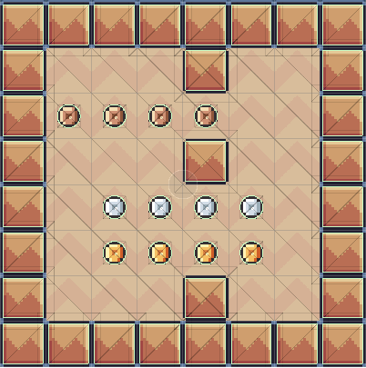

# 코인으로 부자되자! (COIN Challanger; be the rich!)

코인챌린저 게임 알고리즘 작성 가이드 입니다.

플레이어는 게임 당 최대 4명까지 할당 가능합니다.

> map 정보 예시



위와 같은 형태의 맵은 다음과 같이 표현됩니다.

column: 6
row: 6
```
0   	0   	0   	-1  	0   	0
10  	10  	10  	10  	0   	0
0   	0   	0   	-1  	0   	0
0   	30  	30  	30  	30  	0
0   	100 	100 	100 	100 	0
0   	0   	0   	-1  	0   	0
```

이를 배열로 전달할 경우 다음과 같은 형태의 배열이 됩니다.
```
int[] map = new[] {0,0,0,-1,0,0,10,10,10,10,0,0,0,0,0,-1,0,0,0,30,30,30,30,0,0,100,100,100,100,0,0,0,0,-1,0,0 }
```

column 과 row 는 `Initiailize()` 호출 시 함께 전달됩니다.
column 과 row 정보는 게임이 진행되는 동안 플레이어 인스턴스에서 유지해야하는 값입니다.

### 이 템플릿 프로젝트는 코드 작성 예시를 보여주기 위한 프로젝트 입니다. 실제 코드 작성은 자유롭게 하면 됩니다.(IDE 나 tool 의 제약은 없습니다.)

</br>

<details>
<summary>(참고)이전 대비 알고리즘 적용 변경 사항</summary>

## 더이상 dll 파일이 필요하지 않습니다.

> ~IPlayer 인터페이스를 구현하여 빌드한 다음 어셈블리(dll 파일)을 externals/players 에 보관합니다.~ 

20240303_dynamic_load 이후 변경 사항.(https://github.com/shwlee/algo/releases)
- C# 코드 작성 후 해당 cs 파일을 `external/players` 폴더에 위치시키면 게임에서 자동 로딩됩니다.
- 따라서 별도의 어셈블리 빌드가 필요하지 않습니다.

</details>

</br>

## C# 알고리즘 작성 방법과 적용 방법

C# 을 이용한 알고리즘 작성과 적용 방법은 다음과 같습니다.
1. 알고리즘 구현 코드 작성을 위한 코드 편집 툴을 엽니다.(Visual Studio, Visual Studio Code, etc..)
2. C# 클래스를 생성합니다.
   1) **namespance 는 `CSharpPlayer` 클래스명은 `Player` 로 지정합니다.(필수!)**
   2) 구현해야하는 메서드는 본 프로젝트의 IPlayer 인터페이스의 멤버 입니다. 하지만 본 프로젝트의 IPlayer 인터페이스 contract 없이 메서드의 시그니처만 일치시켜 구현합니다.   

3. 간단한 작성 요령은 다음과 같습니다.
```
// 다음 아래 메서드를 해당 클래스에서 구현해주세요. 각 메서드의 이름은 아래 예시와 완전히 일치해야합니다.

void Initialize(int myNumber, int column, int row);
string GetName();
int MoveNext(int[] map, int myPosition);

   - string GetName() 은 본인의 이름을 반환하는 코드를 string 으로 하드 코딩해주세요.
   - void Initialize(int myNumber, int column, int row) 은 게임 시작 초기 한 번 호출되어 map 기준 정보를 전달받게 됩니다. 전달된 인자를 클래스 내부에서 유지하도록 처리해주세요.
   - int MoveNext(int[] map, int myPosition) 이 메서드가 게임 매 턴마다 호출된 알고리즘 입니다. 이 메서드 구현이 가장 핵심입니다. 이 메서드의 반환값이 게임 플레이어의 이동 방향을 결정합니다.
   - (선택) 작성 후 빌드를 한 번 실행해 틀린 곳이 없는지, 실행 가능한 코드인지 확인해 주세요.(빌드 결과물은 필요하지 않습니다.)
```   

 ※ _자세한 코드 내용은 본 프로젝트의 CSharpPlayer 클래스를 참고해주세요._

4. 작성을 마쳤다면 해당 코드 파일을 게임 폴더의 external/players 디렉토리에 복사하여 보관합니다.
5. 게임을 실행하여 동작을 확인합니다.

</br>
</br>

## javascript 를 이용한 알고리즘 작성 방법과 적용 방법

javascript 를 이용한 알고리즘 작성과 적용 방법은 다음과 같습니다.
1. 알고리즘 구현 코드 작성을 위한 코드 편집 툴을 엽니다.(Visual Studio, Visual Studio Code, etc..)
2. js 파일을 생성합니다.
3. 간단한 작성 요령은 다음과 같습니다.
```
// 다음 아래 function 들을 구현해주세요. 각 function 의 이름은 아래 예시와 완전히 일치 해야합니다.

function Initialize(myNumber, column, row);
function GetName();
function MoveNext(map, myPosition);

   - function GetName() 은 본인의 이름을 반환하는 코드를 string 으로 하드 코딩해주세요.
   - function Initialize(myNumber, column, row) 은 게임 시작 초기 한 번 호출되어 map 기준 정보를 전달받게 됩니다. 전달된 인자를 인스턴스 내부에서 유지하도록 처리해주세요.
   - function MoveNext(map, myPosition) 은 매 턴마다 호출된 알고리즘 입니다. 이 function 구현이 가장 핵심입니다. 이 function 의 반환값이 게임 플레이어의 이동 방향을 결정합니다.
   - (선택) 작성 후 빌드를 한 번 실행해 틀린 곳이 없는지, 실행 가능한 코드인지 확인해 주세요.(빌드 결과물은 필요하지 않습니다.)
```   

 ※ _자세한 코드 내용은 본 프로젝트의 JsPlayer 프로젝트를 참고해주세요._

4. 작성을 마쳤다면 해당 코드 파일을 게임 폴더의 external/players 디렉토리에 복사하여 보관합니다.
5. 게임을 실행하여 동작을 확인합니다.

</br>
</br>

## python 를 이용한 알고리즘 작성 방법과 적용 방법 (beta)

python 를 이용한 알고리즘 작성과 적용 방법은 다음과 같습니다.
1. 알고리즘 구현 코드 작성을 위한 코드 편집 툴을 엽니다.(Visual Studio, Visual Studio Code, etc..)
2. py 파일을 생성합니다.
3. 간단한 작성 요령은 다음과 같습니다.
```
// 다음 아래 function 들을 구현해주세요. 각 function 의 이름은 아래 예시와 완전히 일치 해야합니다.

def Initialize(myNumber, column, row);
def GetName();
def MoveNext(map, myPosition);

   - GetName() 은 본인의 이름을 반환하는 코드를 string 으로 하드 코딩해주세요.
   - Initialize(myNumber, column, row) 은 게임 시작 초기 한 번 호출되어 map 기준 정보를 전달받게 됩니다. 전달된 인자를 인스턴스 내부에서 유지하도록 처리해주세요.
   - MoveNext(map, myPosition) 은 매 턴마다 호출된 알고리즘 입니다. 이 function 구현이 가장 핵심입니다. 이 function 의 반환값이 게임 플레이어의 이동 방향을 결정합니다.
   - (선택) 작성 후 빌드를 한 번 실행해 틀린 곳이 없는지, 실행 가능한 코드인지 확인해 주세요.(빌드 결과물은 필요하지 않습니다.)
```   

 ※ _자세한 코드 내용은 본 프로젝트의 PyPlayer 프로젝트를 참고해주세요._

4. 작성을 마쳤다면 해당 코드 파일을 게임 폴더의 external/players 디렉토리에 복사하여 보관합니다.
5. 게임을 실행하여 동작을 확인합니다.